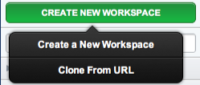
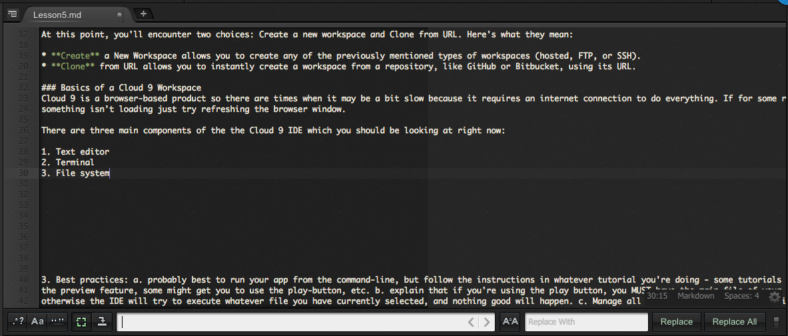
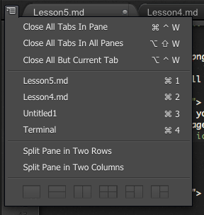
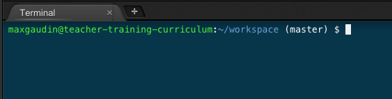
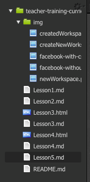

Intro to Cloud 9
=====

Cloud 9 is an integrated development environment, or IDE, that is hosted online and accessed through your browser. Historically IDEs have always been an application
you download onto your computer. Web-based IDEs have come along more recently and provide some great features that make learning more efficient. 

## Getting started
If you're reading this then you're on Github. Github is a great place for hosting and managing your code. If you haven't created a Github account already go ahead and do that by 
going to <a href="https://github.com/">Github.com</a>.Now visit <a href="https://c9.io/">https://c9.io</a>, click Sign In, and click Github to sign in through Github. 

Once signed in you'll be brought to the C9 dashboard. You'll need to setup a workspace.

In the top right click the green button titled "CREATE NEW WORKSPACE" and then "Create New Workspace" again.

At this point, you'll encounter two choices: Create a new workspace and Clone from URL. Here's what they mean:

* **Create** a New Workspace allows you to create any of the previously mentioned types of workspaces (hosted, FTP, or SSH).
* **Clone** from URL allows you to instantly create a workspace from a repository, like GitHub or Bitbucket, using its URL. 

### Creating a workspace

After clicking on Create a new workspace, you're taken to the screen below:

Create a workspace name. The defaults under Workspace Privacy and Hosting are good so don't change them. 

Choose HTML5 as the type of workspace and press Create. That's it! You can now see your new workspace in the dashboard:

Now, just click **Start Editing** to get started!

### Basics of a Cloud 9 Workspace
Cloud 9 is a browser-based product so there are times when it may be a bit slow because it requires an internet connection to do everything. If for some reason
something isn't loading just try refreshing the browser window. 

There are three main components of the the Cloud 9 IDE which you should be looking at right now:

1. Text editor

The text editor is where you'll spend most of your time. There are many features of the text editor that help speed up code creation. 

You can choose which language you're using in the bottom right of the text editor so that it can format your code properly. To do that, click the word
**Text** and select the language you're working in. You can also set the default tab size by clicking **Spaces**. Finally, you can increase or decrease the font 
size by clicking on the **Gear icon**. 

You can open and edit multiple files simultaneously in the C9 text editor. They will appear as tabs at the top similar to what you see with web browsers. 

You'll find more settings by clicking on the icon in the top left of the text editor. 

 

The most valuable settings in here are changing the way you can view multiple files. Click the icons at the bottom of that menu to see how you can 
view multiple files at one time. 

2. Terminal

3. Filesystem

