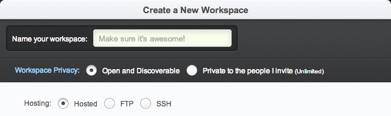
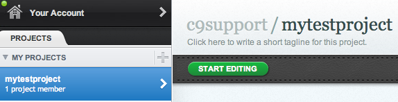

Intro to Cloud 9
=====

Cloud 9 is an integrated development environment, or IDE, that is hosted online and accessed through your browser. Historically IDEs have always been an application
you download onto your computer. Web-based IDEs have come along more recently and provide some great features that make learning more efficient. 

## Getting started
If you're reading this then you're on Github. Github is a great place for hosting and managing your code. If you haven't created a Github account already go ahead and do that by 
going to <a href="https://github.com/">Github.com</a>.Now visit <a href="https://c9.io/">https://c9.io</a>, click Sign In, and click Github to sign in through Github. 

Once signed in you'll be brought to the C9 dashboard. You'll need to setup a workspace.

In the top right click the green button titled "CREATE NEW WORKSPACE" and then "Create New Workspace" again.

At this point, you'll encounter two choices: Create a new workspace and Clone from URL. Here's what they mean:

* **Create** a New Workspace allows you to create any of the previously mentioned types of workspaces (hosted, FTP, or SSH).
* **Clone** from URL allows you to instantly create a workspace from a repository, like GitHub or Bitbucket, using its URL. We'll explain more about this in the section below.

I would like to see screenshots for the processes of: 0. explain we're working across the network, that sometimes this is slow, sometimes packet loss occurs and it may be best in problem solving to first reload the browser.  1. creating/cloning a workspace (explain that we'll mostly be using either a node.js or custom env, and what that means).  2. The major parts of the IDE of interest to us (a. filesystem, b. texteditor c. bash terminal in the console view).  3. Best practices: a. probably best to run your app from the command-line, but follow the instructions in whatever tutorial you're doing - some tutorials may get you to use the preview feature, some might get you to use the play-button, etc. b. explain that if you're using the play button, you MUST have the main file of your app selected first, otherwise the IDE will try to execute whatever file you have currently selected, and nothing good will happen. c. Manage all open in-C9-tabs, both from live-previewing and in the terminal - in other words, don't allow multiple preview-tabs to remain open (this happens by clicking preview without closing a previously running live-preview tab OR by continuing to click the URL provided in the C9 popup when running a server of some sort AND it happens if you click Play multiple times from the menu bar instead of in the Console tab that opens after click play THE FIRST TIME).  Etc.  I think we should provide screenshots were possible with red rectangles for "LOOK HERE"

### Creating a workspace

After clicking on Create a new workspace, you're taken to the screen below:

Create a workspace name. The defaults under Workspace Privacy and Hosting are good so don't change them. 

Choose HTML5 as the type of workspace and press Create. That's it! You can now see your new workspace in the dashboard:

Now, just click **Start Editing** to get started!